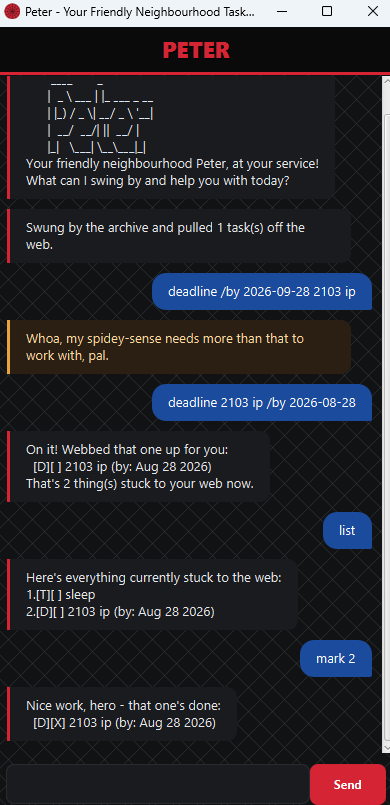

# Peter User Guide



**Peter** is your friendly neighbourhood task manager — a desktop chatbot that tracks your todos, deadlines, and events through a simple line of text. It's optimised for people who type fast: if you can type, Peter can manage your tasks faster than any mouse-driven app.

Peter comes with both a JavaFX GUI (shown above) and a command-line interface. Everything in this guide works the same in either one.

## Table of Contents

- [Quick start](#quick-start)
- [Features](#features)
  - [Adding a todo: `todo`](#adding-a-todo-todo)
  - [Adding a deadline: `deadline`](#adding-a-deadline-deadline)
  - [Adding an event: `event`](#adding-an-event-event)
  - [Listing all tasks: `list`](#listing-all-tasks-list)
  - [Marking a task as done: `mark`](#marking-a-task-as-done-mark)
  - [Unmarking a task: `unmark`](#unmarking-a-task-unmark)
  - [Deleting a task: `delete`](#deleting-a-task-delete)
  - [Viewing your schedule for a date: `schedule`](#viewing-your-schedule-for-a-date-schedule)
  - [Finding tasks by keyword: `find`](#finding-tasks-by-keyword-find)
  - [Exiting the app: `bye`](#exiting-the-app-bye)
- [Saving your data](#saving-your-data)
- [Error handling](#error-handling)
- [Command summary](#command-summary)

## Quick start

1. Ensure you have **Java 25** installed on your computer.
2. Get `peter.jar` by cloning this repo and running `./gradlew shadowJar` — it'll be produced at `build/libs/peter.jar`.
3. Copy the jar file to the folder you want to use as Peter's home folder.
4. Open a terminal in that folder and run:
   ```
   java -jar peter.jar
   ```
5. A window like the one above should appear in a few seconds. It already comes with some example commands you can try, or just type one of the commands below into the text box at the bottom and hit Enter or click **Send**.

## Features

> **Notes on the command format**
> - Words in `UPPER_CASE` are parameters you supply, e.g. in `todo DESCRIPTION`, `DESCRIPTION` is a parameter you can replace with `todo read book`.
> - `DATE` can be typed as `yyyy-MM-dd` (e.g. `2019-12-02`) or with a time as `yyyy-MM-dd HHmm` (e.g. `2019-12-02 1800`, in 24-hour time). Leaving out the time defaults it to midnight.
> - Extra spaces around a command, its parameters, or a date/time are ignored — Peter isn't fussy about spacing.
> - A task's description can't contain a `|` character or a line break — those are used internally by Peter's save file format.

### Adding a todo: `todo`

Adds a todo — a task with no date or time attached.

Format: `todo DESCRIPTION`

Example: `todo read book`

```
On it! Webbed that one up for you:
  [T][ ] read book
That's 1 thing(s) stuck to your web now.
```

### Adding a deadline: `deadline`

Adds a task that needs to be done by a specific date and time.

Format: `deadline DESCRIPTION /by DATE`

Example: `deadline return book /by 2019-12-02 1800`

```
On it! Webbed that one up for you:
  [D][ ] return book (by: Dec 02 2019, 6:00PM)
That's 1 thing(s) stuck to your web now.
```

### Adding an event: `event`

Adds a task that happens over a period of time.

Format: `event DESCRIPTION /from DATE /to DATE`

Example: `event project meeting /from 2019-12-02 1400 /to 2019-12-02 1600`

```
On it! Webbed that one up for you:
  [E][ ] project meeting (from: Dec 02 2019, 2:00PM to: Dec 02 2019, 4:00PM)
That's 1 thing(s) stuck to your web now.
```

The end date/time must be strictly after the start — Peter will reject an event that ends before or at the same moment it starts.

### Listing all tasks: `list`

Shows every task currently in your list, in the order you added them.

Format: `list`

```
Here's everything currently stuck to the web:
1.[T][ ] read book
2.[D][ ] return book (by: Dec 02 2019, 6:00PM)
3.[E][ ] project meeting (from: Dec 02 2019, 2:00PM to: Dec 02 2019, 4:00PM)
```

### Marking a task as done: `mark`

Marks the task at the given position as completed.

Format: `mark INDEX`

`INDEX` refers to the number shown next to a task in `list` (starting at 1).

Example: `mark 2`

```
Nice work, hero - that one's done:
  [D][X] return book (by: Dec 02 2019, 6:00PM)
```

### Unmarking a task: `unmark`

Marks the task at the given position as not yet done.

Format: `unmark INDEX`

Example: `unmark 2`

```
Gotcha, sticking that one back on the web as unfinished:
  [D][ ] return book (by: Dec 02 2019, 6:00PM)
```

### Deleting a task: `delete`

Removes the task at the given position from your list.

Format: `delete INDEX`

Example: `delete 1`

```
Snipped that one clean off the web:
  [T][ ] read book
That's 2 thing(s) left stuck to it.
```

### Viewing your schedule for a date: `schedule`

Shows everything happening on a specific date: deadlines due that day (sorted by time), followed by events starting that day (sorted by time).

Format: `schedule DATE`

`DATE` here does not take a time — just `yyyy-MM-dd`.

Example: `schedule 2019-12-02`

```
Here's what's on the web for that day, deadlines first:
  [D][ ] return book (by: Dec 02 2019, 6:00PM)
  [E][ ] project meeting (from: Dec 02 2019, 2:00PM to: Dec 02 2019, 4:00PM)
```

### Finding tasks by keyword: `find`

Finds all tasks whose description contains the given keyword.

Format: `find KEYWORD`

Example: `find book`

```
Here's what stuck to the web when I searched for that:
1.[T][ ] read book
2.[D][ ] return book (by: Dec 02 2019, 6:00PM)
```

### Exiting the app: `bye`

Says goodbye and closes the app.

Format: `bye`

```
Catch you on the web-swing! Later, pal.
```

## Saving your data

Peter automatically saves your task list to a file on disk after every command that changes it (add, mark, unmark, delete) — there's no separate save command, and no need to save manually before closing the app.

Your data lives in `data/peter.txt`, in the same folder as the jar file, and is loaded back in automatically the next time you start Peter. If that file (or its folder) doesn't exist yet, Peter creates it for you on first run.

## Error handling

Peter tries hard not to crash or lose your data, no matter what you type. A few things worth knowing:

- **Typos and missing details** (an empty description, a missing `/by`, an invalid number) get a friendly error message instead of a crash, and don't change your task list.
- **Duplicate tasks** are rejected — adding the exact same todo, deadline, or event twice (same type, description, and date(s)) gets flagged rather than silently duplicated. Marking a task done doesn't exempt it from this check.
- **Invalid dates** (e.g. `2019-02-30`, which doesn't exist) are rejected rather than silently rounded to a nearby valid date.
- If your save file ever becomes corrupted or hand-edited into something unreadable, Peter skips the broken lines (with a note on the console) and keeps everything else that's still valid, rather than refusing to start.

## Command summary

| Action | Format | Example |
|---|---|---|
| Add a todo | `todo DESCRIPTION` | `todo read book` |
| Add a deadline | `deadline DESCRIPTION /by DATE` | `deadline return book /by 2019-12-02 1800` |
| Add an event | `event DESCRIPTION /from DATE /to DATE` | `event project meeting /from 2019-12-02 1400 /to 2019-12-02 1600` |
| List all tasks | `list` | `list` |
| Mark a task done | `mark INDEX` | `mark 2` |
| Unmark a task | `unmark INDEX` | `unmark 2` |
| Delete a task | `delete INDEX` | `delete 1` |
| View a day's schedule | `schedule DATE` | `schedule 2019-12-02` |
| Find tasks by keyword | `find KEYWORD` | `find book` |
| Exit | `bye` | `bye` |
